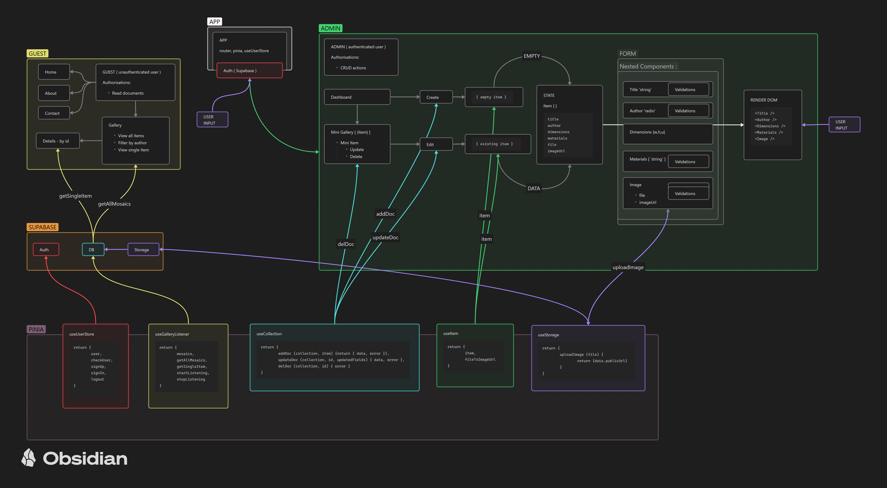
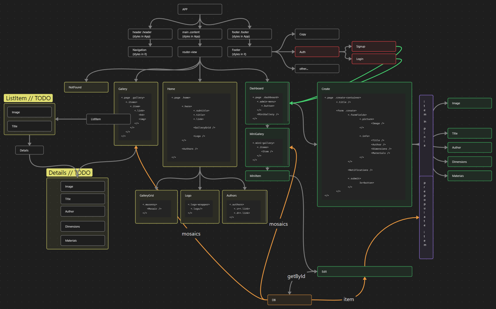

# MOSAICS
##### Virtual gallery app with admin functionalities (in development)
---
**Goal**: A virtual gallery for artists to upload, manage, and display mosaic artworks with real-time updates, authentication, and admin tools.

---
## Table of Contents
1. [Key Features](#key-features)
2. [Architecture Highlights](#architecture-highlights)
3. [Component Flow](#component-flow)
4. [Summary](#summary)
5. [Router Configuration](#router-configuration)
6. [Supabase](#supabase)
   - [useUserStore](#useuserstore)
   - [useItem](#useitem)
   - [useStorage](#useStorage)
   - [useCollection](#useCollection)
   - [useGalleryListener](#useGalleryListener)
7. [App.vue](#appvue)
8. [Styles](#styles)
9. [File Structure](#file-structure)

---
## Key Features
- 🔐 **Authentication System** - Supabase Auth with session management
- 🎨 **CRUD Operations** - Full mosaic management workflow
- 📁 **File Storage** - Image upload with public URLs
- 🔄 **Real-time Updates** - Live gallery synchronization
- 🧭 **Protected Routes** - Admin access control
- 📱 **Responsive Design** - Mobile-first approach

---
## Architecture Highlights
This diagram outlines the relationships between the app's components, stores, and backend services (Supabase). It serves as a quick reference for understanding the project's structure and flow.




- **Vue Router** handles public pages (Home, Gallery, Login) and protected admin routes.
- **Pinia Stores** centralize logic:
  - `useUserStore` for authentication/session
  - `useItem` for item creation workflow
  - `useStorage` for file upload + public URL generation
  - `useCollection` for CRUD operations
  - `useGalleryListener` for real-time sync

- **Global Components**: Navigation, Footer, NotFound
- **SCSS Modules**: Maintain modular and themeable styles with global variables and utility classes.

*****
## Component Flow

Below is a detailed UX-flow diagram of the app



This diagram highlights the relationships between components, pages, and data flow, making it easier to understand the app's architecture at a glance.

---
## Summary

The project uses modern tools and libraries for development, including:

1. Dependencies:

 - Vue 3 (vue), Vue Router (vue-router), and Pinia for state management.
 - Validation libraries (@vuelidate/core, @vuelidate/validators).
 - Supabase for backend integration.

2. Development Tools:

 - Vite for building and serving the app.
 - Vitest for testing, with a UI option (@vitest/ui).
 - Concurrently for running multiple scripts simultaneously.

3. Main Application Setup:

 - The main.js file initializes the Vue app, sets up Pinia with a custom plugin, and integrates Vue Router.
 - Global components like Navigation, Footer, and NotFound are registered.
 - A useUserStore is used to check user-related logic during app initialization.
Vite Configuration:

Configured with Vue plugin and an alias for the src directory (@).
The project appears to be structured for modularity and scalability, with a focus on modern development practices.

---
## Router Configuration 

- Implements Vue Router with lazy-loaded routes for better performance.
- Routes include:
    - Home (/), Gallery (/gallery), and Gallery Details (/gallery/:id).
    - Authentication pages (/login, /signup).
    - Admin pages (/admin/dashboard, /admin/create, /admin/edit/:id).
    - A fallback route for 404 (/:pathMatch(.*)*).

This setup provides a modular and scalable structure for a gallery application with user authentication and admin functionality.

*****

## Supabase

- ### useUserStore
The `useUserStore` composable is a Pinia store for managing user authentication and session state using Supabase. It includes:

- **State**: A `user` ref to store the current user's data.
- **Actions**:
  - `checkUser`: Checks the current session and updates the `user` state.
  - `signUp`: Registers a new user and redirects to the dashboard.
  - `signIn`: Logs in a user and redirects to the dashboard.
  - `logout`: Logs out the user, clears the state, and redirects to the home page.
- **Auth Listener**: Subscribes to Supabase auth state changes to keep the `user` state in sync.

This composable centralizes authentication logic and integrates navigation with Vue Router.

    ```
    useUserStore = defineStore('user', () => {

        const user = ref(null) // reference to store the current user's data

        const checkUser = async () => {
        // Checks the current session and updates the user state.
        }

        const signUp = async (email, password) => {   
        // Registers a new user and redirects to the dashboard on success.      
        } // ---> return { user: data.user, error }

        const signIn = async (email, password) => {
        // Logs in a user and redirects to the dashboard on success.
        
        } // ---> return { user: data.user, error }

        const logout = async () => {
        //  Logs out the user, clears the user state, and redirects to the home page.
        }  

        // Subscribe to auth state changes
        supabase.auth.onAuthStateChange((event, session) => {
        // Listens for authentication state changes (SIGNED_IN, SIGNED_OUT) and updates the user state accordingly.
        })            

        return { user, checkUser, signUp, signIn, logout }        
    })
    ```
- ### useItem

The useItem file defines a Pinia store for managing a new item, likely representing a gallery item in the application. Here's a breakdown:

1. Imports...
2. State:
    - item: A reactive object 
    { title, author, dimensions, materials, file,  imageUrl}
3. Actions:
    - fileToImageUrl: Uploads an image file using useStorage and updates the imageUrl property of the item. Logs success or error messages.
    - resetItem: Resets the item object to its initial state.
    - resetOnLeave: Automatically resets the item state when navigating away from the current route using onBeforeRouteLeave.
4. Return:
    - Exposes { item, resetItem, resetOnLeave, fileToImageUrl } for use in components.

This store centralizes logic for managing and resetting a new item, including handling image uploads and cleaning up state on route changes.


- ### useStorage

The `useStorage` composable handles file uploads and retrieves public URLs for files stored in the Supabase `mosaics` bucket. It includes:

- **Actions**:
  - `uploadImage(file)`:
    - Uploads a file to the `mosaics` bucket with a unique filename.
    - Returns the file path and a public URL for the uploaded file.
    - Throws an error if the upload fails.
  - `getImageUrl(path)`:
    - Generates a public URL for a given file path in the `mosaics` bucket.

This composable centralizes file storage logic, making it easy to integrate Supabase storage functionality into the app.

- ### useCollection

The `useCollection` composable provides CRUD operations for managing collections in Supabase. It includes:

- **Actions**:
  - `addDoc(collection, item)`:
    - Adds a new item to the specified collection in Supabase.
    - Validates that all required fields (`title`, `author`, `dimensions`, `materials`, `imageUrl`) are present.
    - Returns the created item or an error if the operation fails.
  - `updateDoc(collection, id, updatedFields)`:
    - Updates an existing item in the specified collection by its `id`.
    - Returns the updated item or an error if the operation fails.
  - `delDoc(collection, id)`:
    - Deletes an item from the specified collection by its `id`.
    - Logs and alerts the user upon successful deletion or reports an error if it fails.

This composable centralizes collection management logic, making it easier to interact with Supabase for CRUD operations.

- ### useGalleryListener
The `useGalleryListener` composable manages real-time updates and data fetching for the `mosaics` collection in Supabase. It includes:

- **State**:
  - `mosaics`: A reactive array storing all mosaic items.
  - `error`: A reactive reference for tracking errors.

- **Actions**:
  - `getAllMosaics()`:
    - Fetches all mosaic items from the `mosaics` table.
    - Updates the `mosaics` state or logs an error if the fetch fails.
  - `getSingleItem(collection, id)`:
    - Fetches a single item by its `id` from the specified collection.
    - Returns the item or an error if the operation fails.
  - `startListening()`:
    - Subscribes to real-time changes (INSERT, UPDATE, DELETE) in the `mosaics` table.
    - Updates the `mosaics` state dynamically based on the event type.
  - `stopListening()`:
    - Stops the real-time subscription to the `mosaics` table.

This composable centralizes real-time data management and ensures the `mosaics` state stays in sync with the database.


*****

## App.vue

- Defines the main layout of the app with a header, main, and footer.
- Uses global components like Navigation and Footer.
- Includes a <router-view /> in <main> for dynamic routing.
- Scoped SCSS styles define a responsive layout with safe area insets and fixed footer positioning.

*****


## Styles

The main.scss file defines global styles and variables for the application:

1. Variables:
    - Colors (--primary, --secondary, --warning, etc.).
    - Safe area insets for responsive design.
    - Borders, shadows, and accent colors.

2. Global Styles:
    - Resets margins, paddings, and sets box-sizing: border-box.
    - Default font is 'Assistant', sans-serif.

3. Elements:
    - Headings (h1-h6) use the primary color.
    - Links (a) have no underline.
    - Buttons (button, .btn) have hover and disabled states.

4. Forms:
    - Styled inputs, textareas, and labels.
    - Includes custom styles for checkboxes and radio buttons.

5. Utility Classes:
    - .page, .left, .link for layout.
    - .errors, .error, .message for error handling.

The styles emphasize accessibility, responsiveness, and a clean design.

*****

## File Structure

The `/src` directory is organized as follows:

```
src/ 
    [App.vue](./src/App.vue) # Main application componen
    main.js # Application entry point

├── assets/ # Global styles and static assets 
    main.scss 
    |__images/ 
    |__partials/
        |_button_.scss
        |_error.scss
        |_form.scss
        |_link.scss
        |_page.scss
├── components/ # Reusable Vue components 
    Notifications.vue
    ├── footer/ 
        |__Auth.vue
        |__Copy.vue
        |__Footer.vue
    ├── navigation/ 
        Navigation.vue
├── config/ # Configuration files 
    |__[router.js](./src/config/router.js)
    |__supabase.js 
├── stores/ # Pinia stores for state management 
    ├── [useUserStore.js](./src/stores/useUserStore.js) # User authentication store 
    ├── useItem.js # Item management store  
    ├── useStorage.js # File storage logic 
    ├── useCollection.js # CRUD operations for collections 
    |── useGalleryListener.js # Real-time gallery updates 
├── views/ # Page-level components 
    |__ auth/
        Login.vue
        Signup.vue
    ├── home/ # Home page 
        Home.vue
        |__ components
            GalleryGrid.vue
            Authors.vue
            Logo.vue
            Mosaic.vue
    ├── gallery/ # Gallery pages 
        Gallery.vue
        ListItem.vue
        Details.vue
    |── admin/ # Admin dashboard and tools 
        |__components
            Title.vue
            Author.vue
            Dimensions.vue
            Materials.vue
            Image.vue
            Image.test.js
            MiniGallery.vue
            MiniItem.vue
        |__functions
            uploadImg.js
            validateUserInput.js        
        Dashboard.vue
        Create.vue
        Edit.vue
    |__NotFound.vue
```
