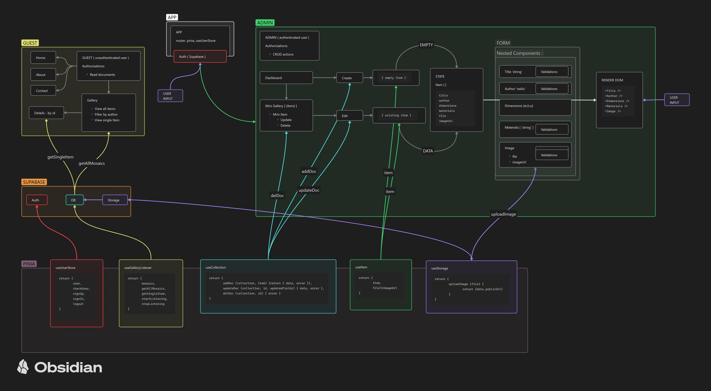
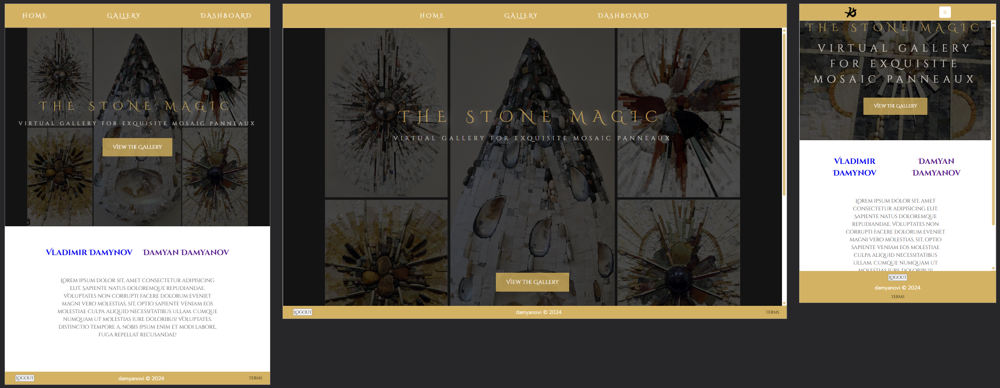
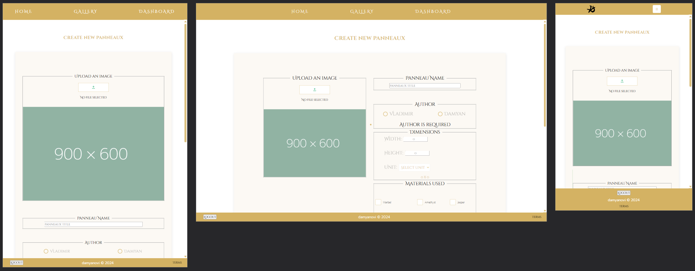

# MOSAICS

(in development)

<!-- Virtual gallery app with admin functionalities -->
A virtual gallery where artists can upload, manage, and showcase mosaic artworks. Built with modern Vue 3 architecture and backed by Supabase for real-time updates, authentication, and media storage.



## 🚀 Features

- User registration and login with Supabase Auth
- Artwork upload with live image previews
- Real-time gallery updates (insert/update/delete)
- Admin dashboard for managing artwork and metadata
- Responsive design with a clean and intuitive interface

## 🛠️ Tech Stack

| Layer      | Tools                                |
|------------|--------------------------------------|
| Frontend   | Vue 3, Vue Router, Pinia, SCSS       |
| Backend    | Supabase (Database, Auth, Storage, Realtime) |
| Tooling    | Vite, Vitest, @vuelidate/core, Concurrently |

## 🧠 Architecture Highlights

- **Vue Router** handles public pages (Home, Gallery, Login) and protected admin routes.
- **Pinia Stores** centralize logic:
  - `useUserStore` for authentication/session
  - `useItem` for item creation workflow
  - `useStorage` for file upload + public URL generation
  - `useCollection` for CRUD operations
  - `useGalleryListener` for real-time sync

- **Global Components**: Navigation, Footer, NotFound
- **SCSS Modules**: Maintain modular and themeable styles with global variables and utility classes.

## 📸 Screenshots

*(Coming soon – responsive design in progress)*


These images showcase core parts of the application.

### 🏠 Home Page


*A clean landing page showcasing featured mosaics.*

---

### 🖼️ Public Gallery


*A scrollable, responsive gallery of mosaic artworks.*

---
### 🎨 Details View


*Details for the artwork - title, author, dimensions, materials, and image url*

<!-- 
💡 Tips for good screenshots
Use light/dark mode contrast if you support both

Hide dev tools or address bar

Use consistent browser size (e.g., 1280×800)

Consider labeling overlays with arrows/text using tools like CleanShot, Snagit, or even Figma

*******

### 🔐 Login Page


*Simple authentication form using Supabase Auth.*

---

### 🧑‍🎨 Admin Dashboard


*Admin panel for managing artworks, authors, and metadata.*

---

### 🎨 Create Mosaic


*Artwork upload form with live image preview and validation.*

 -->

## 📁 Project Structure
```
src/
├── assets/ # SCSS, images, style modules
├── components/ # Global UI components
├── config/ # Supabase, router setup
├── stores/ # Pinia stores (user, item, gallery, etc.)
├── views/ # Pages grouped by route
│ ├── auth/ # Login, Signup
│ ├── home/ # Home and featured components
│ ├── gallery/ # Public gallery pages
│ ├── admin/ # Dashboard, Create, Edit
│ └── NotFound.vue
└── App.vue # Main layout
```

## ⚙️ Getting Started

```bash
# Install dependencies
npm install

# Run the dev server
npm run dev
```

📖 More Documentation
For a deeper breakdown of stores, logic, and architecture:
→ (./COPILOT.md)

🧪 Testing
```bash
# Run Vitest with UI
npx vitest --ui
```

🙌 Credits

Built with ❤️ by Albena Kostova, using open-source tools and modern best practices.